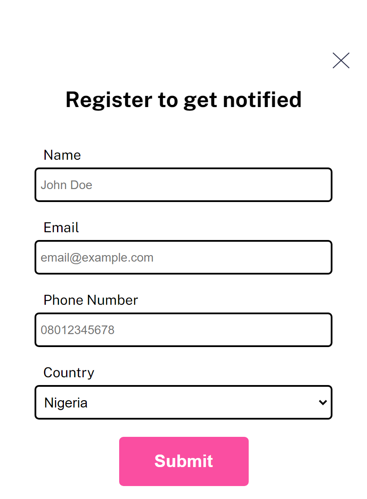
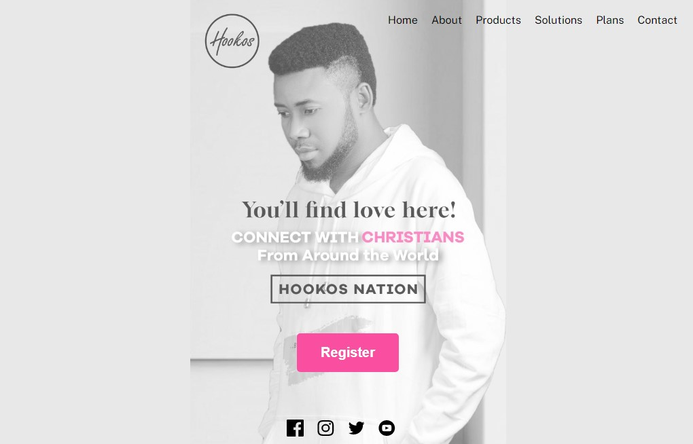
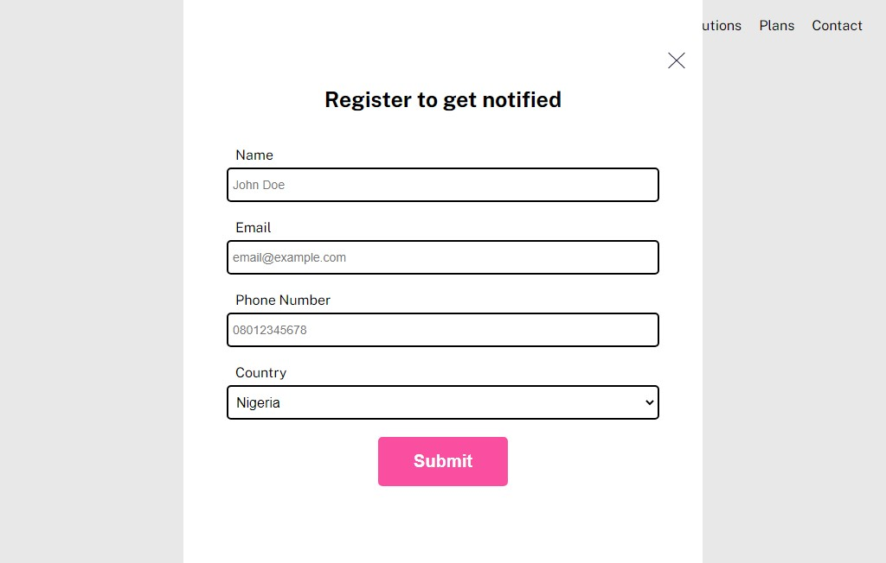

# Briskit landing page interview solution

## Table of contents

- [Overview](#overview)
  - [The challenge](#the-challenge)
  - [Screenshot](#screenshot)
  - [Links](#links)
- [My process](#my-process)
  - [Built with](#built-with)

## Overview

### The challenge

Users should be able to:

- View the optimal layout for the site depending on their device's screen size
- See hover states for all interactive elements on the page
- The background image should cover the entire screen height

### Screenshot

#### Mobile View

#### Desktop View

### Links

- Live Site URL: [Here](https://sagekyle.github.io/briskit-landing-page/)

## Built with

- Semantic HTML5 markup
- CSS
- Mobile-first workflow
- JavaScript
- Rest Countries API
